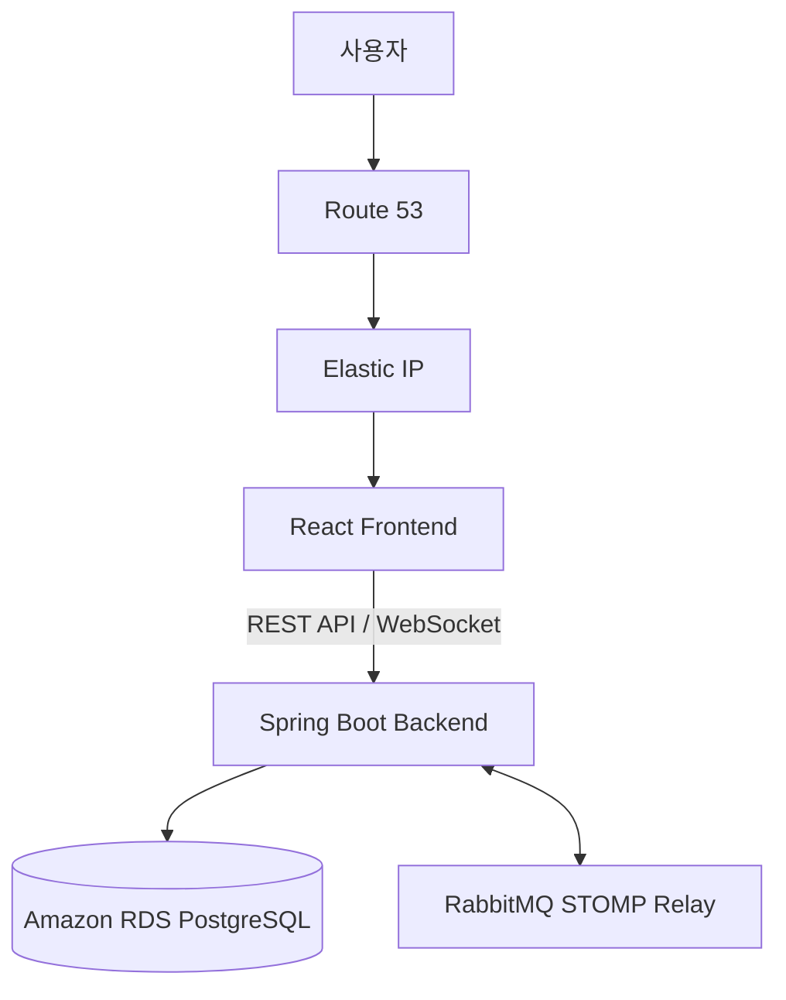
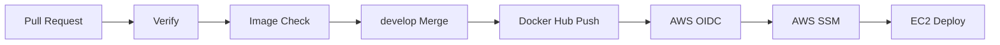
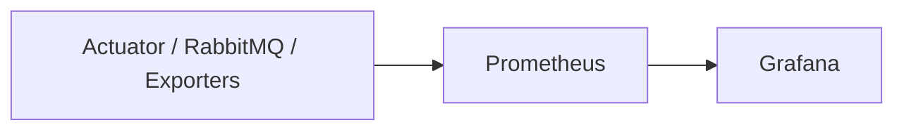

<div align="center">

# 🎮 GameHouse

### 게임 파트너 매칭 서비스

티어·포지션·플레이 스타일·플레이 시간대를 기반으로 게임 파트너를 찾습니다.

파티 탐색부터 신청·승인·실시간 채팅까지 하나의 서비스로 연결합니다.

</div>

---

# 📌 프로젝트 소개

기존 Discord나 인게임 채팅에서는 함께 플레이할 상대의 티어와 성향을 미리 파악하기 어렵습니다.

원하는 조건의 팀원을 찾기 위해 여러 채널을 오가며 모집글을 확인해야 하는 불편도 있습니다.

GameHouse는 게임 정보와 플레이 성향을 기반으로 파티를 탐색할 수 있는 환경을 제공합니다.

참가 신청이 승인되면 파티 채팅방으로 바로 연결되어 게임 전에 역할과 전략을 조율할 수 있습니다.

| 기존 문제 | GameHouse의 해결 방식 |
| --- | --- |
| 상대의 티어·포지션·성향 파악이 어려움 | Riot 계정 연동 및 게임 프로필 제공 |
| 원하는 파티를 찾기 위해 여러 채널을 확인 | 게임·모드·티어·성향별 조건 검색 |
| 신청 후 별도로 연락해야 하는 불편 | 신청 승인 시 파티 채팅방 자동 초대 |
| 서버 확장 시 채팅 메시지가 분리됨 | RabbitMQ STOMP Broker Relay 적용 |

### 매칭 흐름

```text
조건 기반 파티 탐색
        ↓
모집글 참가 신청
        ↓
신청 승인 및 알림
        ↓
파티 채팅방 자동 초대
        ↓
게임 시작 전 역할·전략 조율
```

---

# ✨ 주요 기능

### 🔐 회원가입·인증

정보 입력 → 게임 성향 설문 → 가입 확인의 3단계 회원가입을 제공합니다.

Spring Security와 Stateless JWT를 이용해 사용자를 인증합니다.

### 👤 게임 프로필

Riot 계정을 연동해 현재 티어와 모스트 챔피언을 확인합니다.

선호 포지션, 플레이 시간대, 플레이 성향을 프로필에서 관리합니다.

### 🔍 파티 탐색

게임, 모드, 티어, 포지션, 성향, 마이크 사용 여부, 모집 상태를 기준으로 파티를 검색합니다.

### 🤝 모집 및 신청

모집글을 생성·조회·수정·삭제할 수 있습니다.

사용자는 원하는 모집글에 참가를 신청하고, 모집자는 신청을 승인하거나 거절할 수 있습니다.

### 🟢 친구·알림

친구 신청과 수락 기능을 제공하며 마지막 활동 시각을 기준으로 온라인 상태를 표시합니다.

참가 신청과 승인 결과를 알림으로 확인할 수 있습니다.

### 💬 실시간 채팅

RabbitMQ STOMP Broker Relay를 이용해 1:1 및 그룹 채팅을 제공합니다.

서로 다른 Backend Instance에 연결된 사용자도 메시지를 주고받을 수 있습니다.

### 🏠 마이페이지

내 프로필, 작성한 모집글, 참가 신청 현황을 한곳에서 확인합니다.

> 알림은 현재 10초 주기 Polling 방식입니다.
>
> 관측 결과 특정 시점 `/api/notification`이 전체 요청량의 약 86%를 차지해 실시간 방식으로의 개선을 계획하고 있습니다.

---

# 🏗️ 시스템 아키텍처



| Network | 연결 서비스 | 목적 |
| --- | --- | --- |
| `frontend-net` | Frontend ↔ Backend | 웹 서비스 통신 |
| `backend-net` | Backend ↔ RabbitMQ | 내부 메시지 통신 |
| `observe-net` | Prometheus ↔ Grafana ↔ Exporters | 모니터링 전용 |

- PostgreSQL은 EC2 컨테이너가 아닌 Amazon RDS에서 운영합니다.
- RDS는 Private Subnet에 배치하고 Security Group으로 Backend 접근만 허용합니다.
- RabbitMQ는 `backend-net`에만 연결해 Frontend의 직접 접근을 차단합니다.

---

# 🛠️ 기술 스택

| 영역 | 기술 |
| --- | --- |
| Frontend | React, Vite, React Router, Axios, SockJS, STOMP, `serve` |
| Backend | Java 17, Spring Boot 3, Spring Security, JWT, JPA, WebSocket |
| Database | PostgreSQL, Amazon RDS |
| Messaging | RabbitMQ, STOMP Broker Relay |
| DevOps | Docker, Docker Compose, GitHub Actions, Docker Hub |
| AWS | EC2, RDS, Route 53, Elastic IP, VPC, SSM, OIDC |
| Monitoring | Prometheus, Grafana, cAdvisor, node-exporter, postgres-exporter, Actuator |

---

# 🚀 기술적 성과

| 영역 | 적용 내용 | 결과 |
| --- | --- | --- |
| Backend Image | Multi-stage Build + `jlink` Custom JRE | 약 645MB → 339MB |
| Frontend Image | Vite Build + `serve` Runtime | 약 410MB → 270~275MB |
| Runtime Config | `config.js` 환경변수 주입 | 환경별 Image 재빌드 제거 |
| CI | Secret Scan + Build + Smoke Test | 검증 실패 Image 발행 차단 |
| CD | GitHub OIDC + AWS SSM | Access Key·SSH 없는 자동 배포 |
| Chat | RabbitMQ Broker Relay | 다중 Backend 간 메시지 공유 |
| Observability | 5계층 Metric 수집 | 장애 원인을 수치 기반으로 추적 |

---

# 🔄 CI/CD



<details>
<summary><b>CI 상세 보기</b></summary>

### Verify

- `gitleaks`를 이용한 API Key·Token·Password 유출 검사
- PR 단계에서 Secret이 Git History에 들어가기 전에 차단

### Image Check

Backend

- Spring Boot 및 Docker Image Build
- PostgreSQL Test Container 연결
- `GET /api/posts`의 `200` 응답 확인
- Application 기동·Security·DB 연결 동시 검증

Frontend

- Vite 및 Docker Image Build
- `serve` 기반 Container 실행
- `GET /`의 `200` 응답과 `<div id="root">` 확인

### Publish

- PR에서는 검증만 수행하고 Image를 발행하지 않음
- `develop` Merge 후 모든 검증을 통과한 Image만 발행
- 최신 배포용 `backend-develop`, `frontend-develop` Tag 생성
- 추적·Rollback용 `backend-{SHA}`, `frontend-{SHA}` Tag 생성

</details>

<details>
<summary><b>CD 상세 보기</b></summary>

### Keyless 인증

GitHub OIDC로 IAM Role을 Assume하고 임시 AWS 자격증명을 발급받습니다.

장기 AWS Access Key를 GitHub Secrets에 저장하지 않습니다.

### SSH 없는 배포

AWS Systems Manager가 EC2에서 `infra/scripts/deploy.sh`를 실행합니다.

SSH Key와 외부 22번 Port가 필요하지 않습니다.

### 배포 순서

1. Infra Repository 최신화
2. Compose 및 `.env` 검증
3. 최신 Docker Image Pull
4. 변경된 Container 재생성
5. RabbitMQ·Backend·Frontend Health Check
6. Spring Boot Actuator `UP` 확인
7. Monitoring Stack 실행
8. Prometheus 설정 반영
9. Monitoring Container 상태 확인

```bash
docker compose pull
docker compose up -d --remove-orphans
docker compose ps
```

`set -Eeuo pipefail`로 오류 발생 시 즉시 실패 처리합니다.

Rollback Image 보존을 위해 자동 Image Prune은 비활성화했습니다.

</details>

---

# 🐳 Docker

| Service | 실행 환경 | 역할 |
| --- | --- | --- |
| Frontend | React + Vite + `serve` | 정적 Web Application 제공 |
| Backend | Spring Boot 3 + Custom JRE | REST API 및 WebSocket 처리 |
| RabbitMQ | RabbitMQ + STOMP Plugin | 실시간 메시지 Relay |
| Database | Amazon RDS for PostgreSQL | 서비스 및 채팅 기록 저장 |

<details>
<summary><b>Docker Image 최적화 상세 보기</b></summary>

### Backend

- Multi-stage Build
- Gradle `bootJar` 생성
- `jlink` Custom JRE 적용
- Non-root User(`spring`) 실행
- Runtime Image에서 JDK·Gradle·Source 제거
- 의존성 Layer 분리 및 GitHub Actions Cache 활용

### Frontend

- Multi-stage Build
- Runtime Image에 `dist`와 `serve`만 포함
- Container 시작 시 Runtime `config.js` 생성
- 동일 Image를 Local·운영 환경에서 공용 사용

> Nginx Image 대비 Node.js Runtime으로 크기가 증가하는 Trade-off가 있습니다.
>
> 대신 중복 Reverse Proxy를 제거하고 향후 ALB 환경에서도 동일 Image를 재사용할 수 있도록 운영 단순성을 선택했습니다.

</details>

---

# 📊 Observability



| 계층 | 수집 대상 |
| --- | --- |
| Container | CPU, Memory, Network |
| EC2 Host | Disk, Memory, Load |
| Application | 요청량, p95, 5xx, HikariCP |
| RabbitMQ | Queue 적체, 미확인 메시지 |
| RDS | PostgreSQL 연결 상태 및 연결 수 |

<details>
<summary><b>Monitoring 설계 및 발견 사례 보기</b></summary>

### 설계

- `scrape_interval` 30초
- `metric_relabel_configs` Allowlist로 Cardinality 제어
- Prometheus 보관 기간 7일, 최대 용량 2GB
- Grafana Datasource 및 Dashboard를 코드로 Provisioning
- 수집 → Container → Application → 기능 → DB → Host 순서로 장애 범위 축소

### 실제 발견 사례

- Riot 닉네임 오입력 `404`를 서버 오류 `500`으로 반환하던 문제
- Riot 연동 1회당 API 4회 호출로 25명만 연동해도 2분당 100회 한도에 도달할 수 있는 문제
- `/api/notification`이 특정 시점 요청량의 약 86%를 차지한 Polling 부하
- 수집 주기보다 짧은 `rate` 범위로 CPU Graph가 끊기는 Monitoring 설정 오류

</details>

## 🚨 알람 및 장애 대응 고도화

현재 Prometheus와 Grafana를 통해 Metric을 수집하고 Dashboard에서 상태를 확인할 수 있습니다.

하지만 Dashboard는 사람이 직접 열어야만 이상 징후를 확인할 수 있습니다.

장애를 사전에 감지하고 원인을 빠르게 분석할 수 있도록 CloudWatch, Grafana Alerting, Loki를 활용한 알람 및 로그 체계를 추가할 계획입니다.

### ☁️ RDS Storage 알람

RDS Storage가 모두 사용되면 Database가 읽기 전용 상태로 전환될 수 있습니다.

이 경우 회원가입, 모집글 작성, 채팅 저장과 같은 쓰기 작업이 실패할 수 있습니다.

RDS 내부 Storage는 Exporter가 아닌 AWS CloudWatch의 `FreeStorageSpace` Metric으로 감시합니다.

| 단계 | Metric | 임계값 | 평가 조건 | 알림 방식 |
| --- | --- | --- | --- | --- |
| 경고 | `FreeStorageSpace` | 4GB 이하 | 15분 동안 3회 충족 | SNS → Email |
| 위험 | `FreeStorageSpace` | 2GB 이하 | 15분 동안 3회 충족 | SNS → Email |

### 🔔 Grafana Alerting

별도의 Alertmanager Container를 추가하지 않고 기존 Grafana의 Alerting 기능을 활용합니다.

Metric 조회와 Dashboard, 알림 Channel을 Grafana에서 함께 관리합니다.

| Alert Rule | 조건 | 목적 |
| --- | --- | --- |
| 수집 중단 | `up == 0` 상태가 5분간 지속 | Monitoring 대상 또는 수집기 장애 감지 |
| Host Disk | Disk 사용률 85% 초과 | Docker Image와 Log 누적으로 인한 Disk 고갈 방지 |
| 채팅 Queue 적체 | 대기 Message가 10분간 계속 증가 | 사용자에게 오류가 표시되지 않는 채팅 지연 감지 |
| Riot API 한도 | `429` 응답 발생 | Rate Limit 초과로 인한 계정 연동 장애 감지 |

### 📜 Loki 중앙 Log 수집

Metric은 장애 발생 시점과 영향을 알려주지만 구체적인 원인은 Application Log에서 확인해야 합니다.

현재는 EC2에 접속해 `docker logs`를 직접 확인해야 하므로 장애 분석 과정이 수동으로 끊겨 있습니다.

Loki를 추가해 Container Log를 중앙에서 수집하고 Grafana에서 Metric과 Log를 함께 조회할 계획입니다.

```text
Grafana Alert 발생
        ↓
장애 Metric과 발생 시각 확인
        ↓
같은 시각의 Loki Log 조회
        ↓
오류 원인 분석 및 대응
```

### 기대 효과

- RDS Storage 부족을 Service 장애 전에 감지

- Monitoring 대상과 수집기의 중단 상태 자동 감지

- 채팅 Queue 적체와 Riot API Rate Limit 즉시 확인

- Metric과 Log를 연결한 원인 분석

- Dashboard를 계속 확인하지 않아도 되는 운영 알림 자동화

---

# 🔧 주요 문제 해결

### 1. Nginx 제거 후 `/api`·`/ws` Routing 소멸

| 구분 | 내용 |
| --- | --- |
| 문제 | `serve` 전환 후 Reverse Proxy가 사라져 API·WebSocket 요청이 `index.html`로 전달됨 |
| 원인 | `serve`는 SPA 정적 파일 제공만 담당하고 Proxy 기능을 제공하지 않음 |
| 해결 | Container 시작 시 환경변수를 `dist/config.js`의 `window.__ENV__`로 주입 |
| 결과 | 환경이 바뀌어도 Image 재빌드 없이 환경변수만 교체 가능 |

### 2. 서버 증설 시 채팅 메시지 미공유

| 구분 | 내용 |
| --- | --- |
| 문제 | `enableSimpleBroker`가 각 Backend Memory에 메시지를 보관 |
| 원인 | 서로 다른 Backend에 연결된 사용자 사이에서 메시지 공유 불가 |
| 해결 | RabbitMQ `enableStompBrokerRelay` 적용 및 Routing 규칙 변경 |
| 검증 | Backend 2대(`8080`, `8081`) 사이에서 양방향 채팅 확인 |
| 결과 | 다중 Backend 환경에서 메시지 공유, 채팅 기록은 RDS에 영구 저장 |

---

# 🧩 MSA 전환 계획

| Service | 담당 기능 | 분리 목적 |
| --- | --- | --- |
| Auth & User | 회원가입, 로그인, JWT, 프로필 | 보안이 중요한 회원 정보 전담 |
| Social & Community | 친구, 온라인 상태, 모집글 | Community Data 집중 처리 |
| Chat | RabbitMQ STOMP Messaging | 실시간 Traffic 영향 격리 |
| Riot Integration | 계정 연동, 티어 조회 | 외부 API 장애 및 Rate Limit 영향 격리 |

---

# 📅 향후 계획

| 계획 | 기대 효과 |
| --- | --- |
| Frontend S3 + CloudFront 이전 | 응답 속도 향상, EC2 부하 감소 |
| ALB 도입 | Backend 직접 노출 제거, Traffic 분산 |
| Upload File S3 이전 | 다중 Instance File 공유 |
| Amazon EKS 전환 | 자동 복구, Rolling Update, Auto Scaling |
| Argo CD 기반 GitOps | 선언형 배포, 손쉬운 Rollback |
| Loki·Grafana Alerting·CloudWatch | 중앙 Log 수집 및 장애 알림 |
| Riot API Cache·동기화 | 최신 전적 제공, Rate Limit 절감 |
| WebSocket Sticky Session | 다중 Instance 장애 복구 |

---

# 📦 Repositories

| Repository | 설명 |
| --- | --- |
| [`frontend`](https://github.com/NexusOps-gamehouse/frontend) | React / Vite / Frontend CI |
| [`backend`](https://github.com/NexusOps-gamehouse/backend) | Spring Boot API / Backend CI |
| [`infra`](https://github.com/NexusOps-gamehouse/infra) | Docker Compose / CI-CD / AWS / Monitoring |

---

# 👥 Team NexusOps

| 역할 | 팀원 |
| --- | --- |
| PM | 이태환 |
| Frontend | 박윤희, 남서현, 조현우 |
| Backend | 이태환, 이석현, 오수아 |
| DevOps | 전 팀원 |

---

<div align="center">

**GameHouse**  
DevOps & Cloud Native Team Project

</div>
