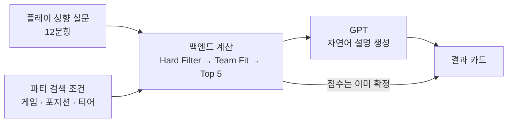
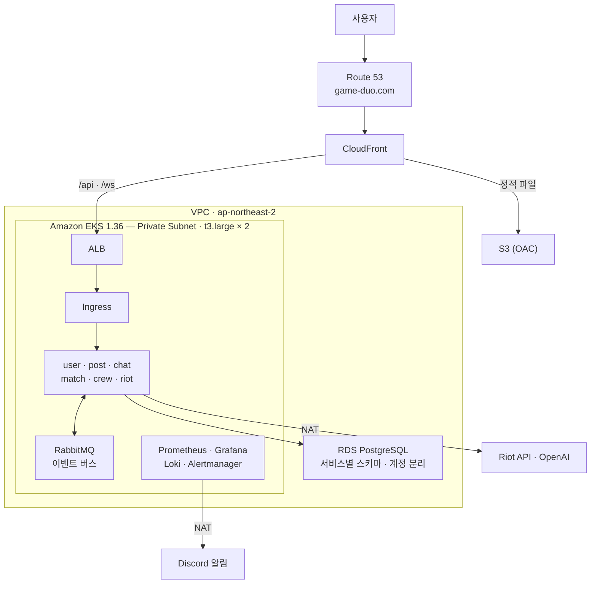

# GameHouse

**게임 성향이 맞는 사람을 찾아주는 파티 매칭 플랫폼**

[https://game-duo.com](https://game-duo.com)

Spring Boot MSA · React · Amazon EKS · Argo CD GitOps

---

## 무엇을 푸는가

게임에서 같이 할 사람을 구할 때, 기존 방식은 **조건**만 맞춰준다. 티어가 같고, 포지션이 비어 있고, 시간이 맞는 사람. 그런데 실제로 한 판이 즐거운지를 가르는 것은 조건이 아니라 **성향**이다. 이기는 걸 얼마나 중요하게 여기는지, 실수에 얼마나 너그러운지, 말을 얼마나 하는지.

GameHouse는 가입할 때 받은 12문항의 플레이 성향 설문을 바탕으로, 조건이 맞는 파티들 중에서 **나와 잘 맞을 파티를 점수로 골라내고, 왜 맞는지를 문장으로 설명해 준다.**

그리고 한 번 잘 맞았던 사람들이 흩어지지 않도록, 함께한 기록을 모아 **House(크루)** 로 이어준다.

---

## 주요 기능

| | 기능 | 설명 |
|---|---|---|
| 🎯 | **Team Fit 매칭** | 9개 축 · 100점 만점으로 파티 적합도를 계산하고 상위 5개를 추천 |
| 💬 | **AI 매칭 설명** | 계산된 점수를 근거로 "왜 이 파티가 맞는지"를 자연어로 생성 |
| 📝 | **파티 모집** | 게임 · 포지션 · 티어 · 인원 조건으로 모집글 작성 · 신청 · 승인 |
| 🔗 | **라이엇 계정 연동** | Riot API 로 실제 티어 · 전적을 프로필에 반영 |
| 🗨️ | **실시간 채팅** | 파티 확정 시 채팅방 자동 생성 (STOMP over WebSocket) |
| 🏠 | **House (크루)** | 함께 플레이한 기록을 모아 지속적인 모임으로. 공지 · 일정 · 전용 채팅 · 랭킹 |
| 🎨 | **커스터마이징** | House 활동으로 얻은 재화로 채팅 테마 · 아바타 구매 |
| 👥 | **친구 · 알림** | 친구 등록, 신청/승인 알림 |

---

## Team Fit 매칭이 동작하는 방식

이 프로젝트에서 **AI 를 어디에 썼고 어디에 쓰지 않았는지**가 가장 분명하게 드러나는 부분이다.

**점수는 백엔드가 계산한다.** 승리 지향성 20 · 소통 적극성 16 · 플레이 시간대 15 · 주도성 12 · 실수 관용도 8 · 플레이 집중도 8 · 친목 성향 8 · 나이 8 · 음성 채팅 5 — 합계 100점. 가중치도 계산식도 코드 안에 있고, 재현 가능하다.

**AI 는 그 결과를 설명만 한다.** 계산된 축별 점수와 기여도를 JSON 으로 받아, 순위를 바꾸지 않고 근거를 문장으로 옮긴다. 호출은 1위 파티 하나에만, 타임아웃 3초, 실패하면 규칙 기반 문구로 대체된다.

추천의 근거를 AI 가 만들면 같은 입력에 다른 결과가 나오고, 왜 그 파티가 1위인지 설명할 수 없게 된다. **판단은 코드가, 설명은 AI 가** — 경계를 이렇게 그었다.

---

## 시스템 아키텍처

**서비스는 서로를 직접 호출하지 않는다.** 상태 변화는 RabbitMQ 이벤트로 알리고, 필요한 쪽이 자기 DB 에 복제해 둔다. DB 계정도 서비스별로 나눠 남의 테이블을 읽을 수 없게 막았다. 경계를 코드 컨벤션이 아니라 **권한으로** 강제한 것이다.

**모든 워크로드는 Private Subnet 에 있다.** 외부에서 들어오는 경로는 ALB 하나뿐이고, 나가는 경로는 NAT 하나뿐이다.

---

## 레포 구성

| 레포 | 무엇 |
|---|---|
| [gamehouse-user](https://github.com/NexusOps-gamehouse/gamehouse-user) | 계정 · 프로필 · 친구 · 알림 |
| [gamehouse-post](https://github.com/NexusOps-gamehouse/gamehouse-post) | 파티 모집글 · 신청 |
| [gamehouse-chat](https://github.com/NexusOps-gamehouse/gamehouse-chat) | 파티 채팅 |
| [gamehouse-match](https://github.com/NexusOps-gamehouse/gamehouse-match) | Team Fit 매칭 · AI 설명 |
| [gamehouse-crew](https://github.com/NexusOps-gamehouse/gamehouse-crew) | House · 함께한 기록 · 상점 |
| [gamehouse-riot](https://github.com/NexusOps-gamehouse/gamehouse-riot) | Riot API 연동 |
| [gamehouse-common](https://github.com/NexusOps-gamehouse/gamehouse-common) | 서비스 간 이벤트 계약 |
| [frontend](https://github.com/NexusOps-gamehouse/frontend) | React SPA |
| [infra](https://github.com/NexusOps-gamehouse/infra) | 매니페스트 · GitOps · 관측 · 부하 테스트 |
| [backend](https://github.com/NexusOps-gamehouse/backend) | 보관 — 레포를 나누기 전의 모노레포 |

> 처음 보신다면 **[infra](https://github.com/NexusOps-gamehouse/infra)** 부터 보시길 권합니다. 전체가 어떻게 조립되고 배포되는지가 거기 있습니다.

---

## 기술 스택

| 영역 | |
|---|---|
| **Frontend** | React 18 · Vite 5 · React Router 6 · axios · STOMP over SockJS |
| **Backend** | Java 17 · Spring Boot 3.3.5 · Spring Security (JWT) · JPA · Gradle |
| **Data** | PostgreSQL (RDS) — 서비스별 스키마 · 계정 분리 |
| **Messaging** | RabbitMQ — Topic Exchange 기반 이벤트 |
| **AI · 외부 연동** | OpenAI API · Riot Games API |
| **Container** | Docker (jlink 최소 JRE) · Amazon ECR |
| **Orchestration** | Amazon EKS 1.36 · Kustomize · HPA · NetworkPolicy |
| **GitOps** | Argo CD (app-of-apps · selfHeal) |
| **AWS** | ALB · S3 + CloudFront (OAC) · RDS · Secrets Manager · Route 53 · NAT |
| **Observability** | Prometheus · Grafana · Loki · Alloy · Alertmanager → Discord |
| **CI/CD** | GitHub Actions · gitleaks · k6 |

---

## 팀 · NexusOps

| | GitHub | 담당 |
|---|---|---|
| 이석현 | [@seokhyeon2356](https://github.com/seokhyeon2356) | |
| 조현우 | [@nunucho](https://github.com/nunucho) | |
| 남서현 | [@DOOYEE0709](https://github.com/DOOYEE0709) | |
| 이태환 | [@HwantaLee](https://github.com/HwantaLee) | |
| 박윤희 | [@oxlhee-yunhee](https://github.com/oxlhee-yunhee) | |
| 오수아 | [@lorancherry-wq](https://github.com/lorancherry-wq) | |

---

## 개발 기간

**2026.07 ~ 2026.09** · 약 2개월

| 기간 | |
|---|---|
| 2026.07 | 기획 · 와이어프레임 · 단일 애플리케이션 MVP |
| 2026.08 | Gradle 멀티모듈로 서비스 경계 분리 → 레포 분리 (MSA) |
| 2026.08 ~ 09 | EC2 + Docker Compose → Amazon EKS 이전, Argo CD GitOps 구축 |
| 2026.09 | 관측 스택 구축 · 부하 테스트 · Team Fit 매칭 고도화 |

---

KT Cloud TECH UP · Cloud Native 3회차

